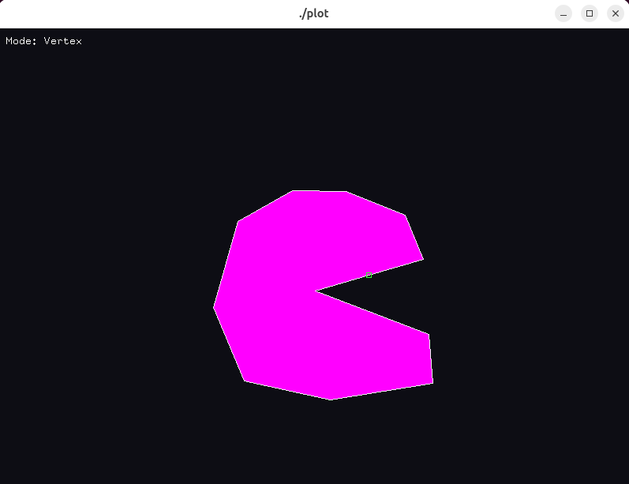

# Interactive 2D Polygon Editor

Interactive application written in **C and OpenGL** allowing users to create, edit and fill polygons using the **scan-line filling algorithm**.

## Screenshot



## Features

- Interactive polygon creation using mouse input
- Vertex and edge manipulation
- Scan-line polygon filling algorithm
- Real-time rendering using OpenGL

## Technologies

- C
- OpenGL
- GLUT

## Concepts explored

- Computational geometry
- Scan-line rasterization
- Interactive graphics programming

## Build

To compile the project:

```bash
make
